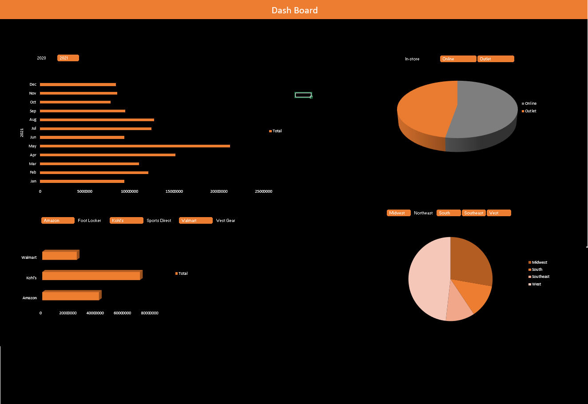

# Excel Dashboard

## Description
- In this Dashboard we analyzed data of sales in the various cities, various categories.
- Primary Goal of this project is to gain the work experience in real life projects using my skills.

## Features

- **Choose Particular Year for Analyze**
- **Analyze data at Particular Regions**
- **Analyze data at Particular Category**
- **Analyze data at Particular Retailer**

## Tools Used in Excel

- **Pivot Chart*
- **Pivot Table*
- **Charts**
- **Slicer**
- **Report Conection in Slicer**

## Getting Started

1. Clone the repository
    ```bash
    https://github.com/25sudharsan27/excel_dashboard1.git
  
2. Open Dashboard.xlsx

## Screenshots




